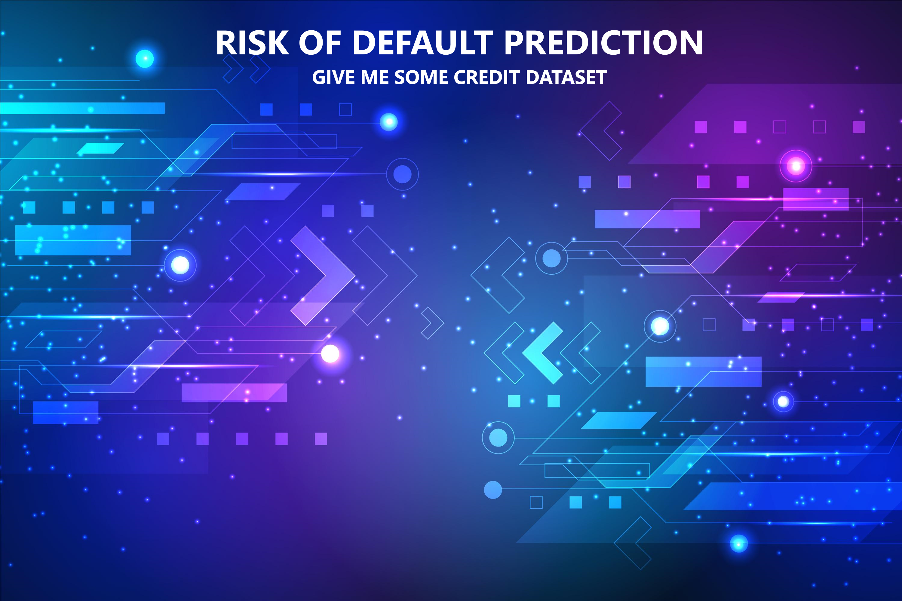
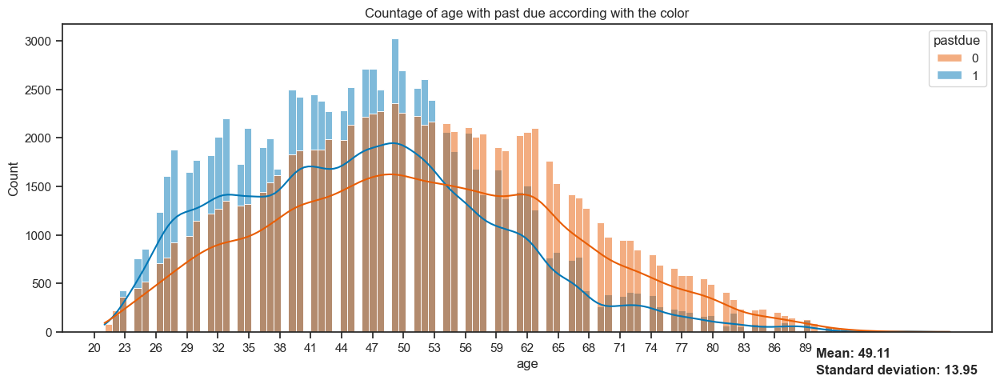
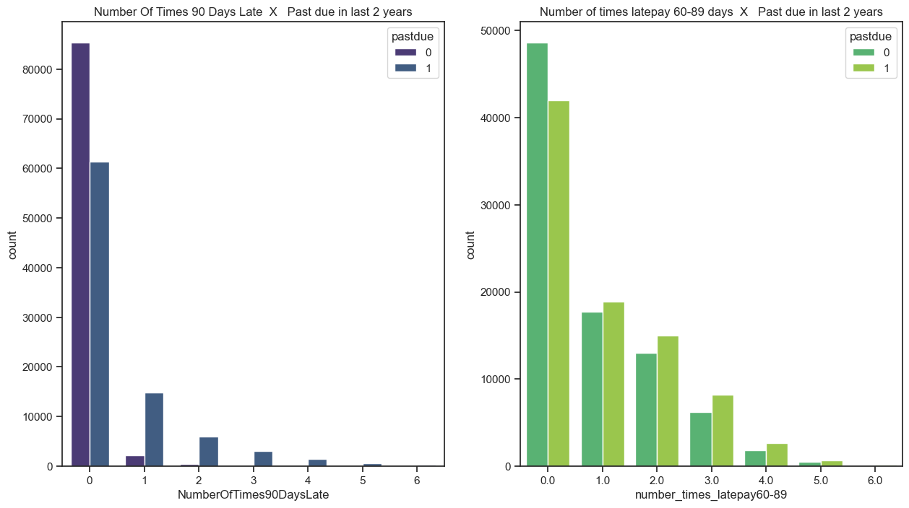
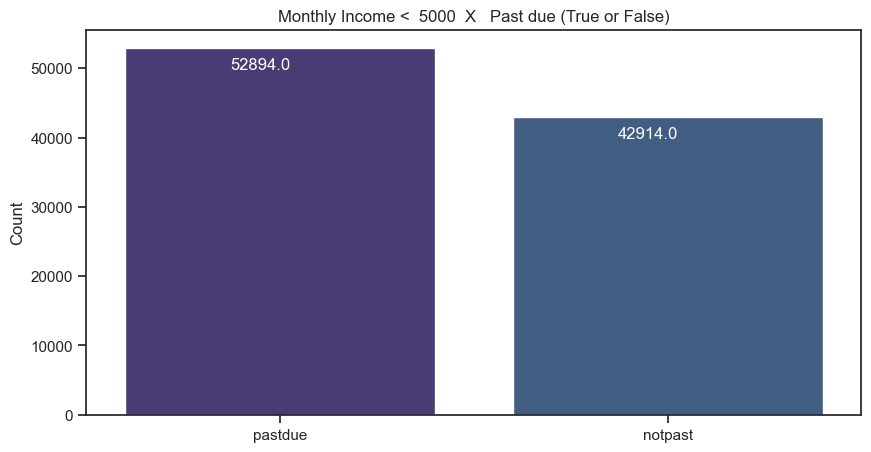
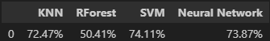
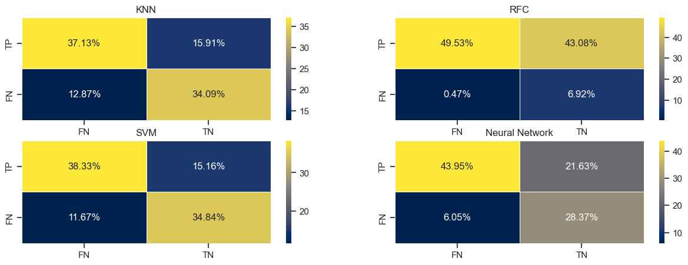

<h1 align="center"> Give me Some Credit analysis </h1> <br>


## Table of Contents

- [Business problem](#introduction)
- [Roadmap](#Roadmap)
- [Considerations](#Considerations)
- [Development](#Development)
- [Insights](#Insights)
- [Machine Learning](#machine-)

<!-- END doctoc generated TOC please keep comment here to allow auto update -->

## Business problem

- Here you can follow the official description about the data collected at [Kaggle](https://www.kaggle.com/c/GiveMeSomeCredit):
``` 
  "    The Bank decides who can get finance and on what terms and can make or break investment decisions. For markets and society to function, individuals and companies need access to credit. Credit scoring algorithms, which guess the probability of default, are the methods banks use to determine whether or not a loan should be granted.
   This competition requires participants to improve on the state of the art in credit scoring, by predicting the probability that somebody will experience financial distress in the next two years.       "
   ```


-  Followed by this description, I would like to introduce by myself:
>   Imagine you are a bank owner who recently opened this business. Among other banking problems (such as a management system, security system, etc.), you notice that your bank is offering loans to people who are not paying their debts properly. In addition, employees are offering them credit limits that are far above normal when compared to their monthly income. So, you decide to hire a general team of Data Scientists/Machine learning who are offering a credit analysis system to determine whether a loan should be granted or not. So, for now, you are the bank owner and I'm in the development team :). My team's task is to develop a model from the provided dataset and send it to another team to link the system itself to the model

## Roadmap


  | Goal | Problem |
| -|-|
| Business growth | Whether or not a loan should be granted | 


## Development
#### Final product:
- A model in .pkl extension
- A simple deploy using Flask to access this .pkl file
#### Tools:
- Python (matplotlib, numpy, pandas, scikit-learn, seaborn, imblearn, tensorflow, pickle and Flask)
- Kaggle (for data acquisition in  .csv)
- HTML, CSS (for a basic deployment page)
- Git, GitHub
- VS code
### Cycle of development
PS: Notice that the following development cycle has a proccess that I divided at 3 parts: Data preparation is divided within this topics:
> **3.    Data cleaning**  |
> **4.    EDA - Exploratory Data Analysis**  |
>**5.    Data pre-processing**


<a href="https://www.researchgate.net/figure/Steps-of-data-mining_fig1_349788796"></a></img>
Please look at the author of this data mining process:
>Educational Data Mining To Improve The Academic Performance in Higher Education - Scientific Figure on ResearchGate. Available from: https://www.researchgate.net/figure/Steps-of-data-mining_fig1_349788796 [accessed 2 Sept 2024]

Each step is exemplified both notebooks


## Data:
- The dataset, was collected at [Kaggle](https://www.kaggle.com/c/GiveMeSomeCredit):  
- The dataset has 11 features after extraction and represents variables that might collaborate or not for the risk of default 
## Top Insights:
- 1.0 - The number of borrowers is higher between 39-49 years old when they have any overdue bills
</img>


- 2.0 - Borrowers who have overdue bills have had bills that are 60 days or more past due **in the last 2 years**
</img>

- 3.0 - There are more people that are in debt when their income is fewer than 5000
</img>

## Machine Learning model:
- This was a quickly development project, so I tried to perform model training in four (4) different Machine Learning models. If getting deeper, the accuracy can certainly gets higher while changing hyperparameters.
- Firstly,  the data was correctly cleaned including but not limited to: Oversampling, removing outliers, removing NaN (Not a Number) values, separating into training and test set and performing data pre-processing using **Standard Scaler Normalization**.

This is the overall accuracy of the models:



- Lets highlight the Neural Network and SVM models which got the most accuracy.
Lets check the confussion matrix:


> You can see that, in some cases like the True Positives rate the NN worked better (depending on the business problem, the data scientist should minimize the False Negative samples using a correct model. for example: classifying whether or not a cancer diagnosis)

**Why I choose SVM model:**
- Usually, SVM can be computacionally expensive while changing the kernels (example: linear, sigmoid... ), but how do we have (theorically) a fewer dataset than usual (therabytes of data), SVM can be very fast even with a diverse number of features that has a simple relationship.
- Also, I would select NN (neural networks) only if I wanted a very precise result with high number of data samples (what would be less computacionally expensive than SVM ) 

## Conclusion:
After analysing the results, i've selected the model with the most reasonable accuracy (other details explained in the previous chapter). The model is **SVM (Suport Vector Machines)**
There is some possible corrections to avoid the risk of default:
- Limit or cancel the number of loans for people who already had overdue bills for more than 90+ days. Also, do not grant any loan to a person who has an active overdue bill in the actual bank or in others (if the information is available)
- The loan should be limited, or the management system should be aware that most people that has overdue bills have between 41-53 years old.
- If available, check the past of the borrower in other sources of data. Example: In Brazil, there is the Serasa. It is responsible for gathering information, conducting research and analysis on individuals and companies that are in financial debt or not. (bank would check the financial past of the client there)
## Contributors
This is my first full project in Data Science role and I want to provide some supports and some templates that I used to create this structure of project. Also, providing auxiliar pages that helped me.
- [Understanding deep learning book by Simon J.D. Prince ](https://udlbook.github.io/udlbook/)
- [Data Preparation for Machine Learning Data Cleaning, Feature Selection, and Data Transforms in Python by Jason Brownlee ](https://github.com/aaaastark/Data-Scientist-Books/blob/main/Data%20Preparation%20for%20Machine%20Learning%20Data%20Cleaning%2C%20Feature%20Selection%2C%20and%20Data%20Transforms%20in%20Python%20by%20Jason%20Brownlee%20(z-lib.org).pdf)
- Educational Data Mining To Improve The Academic Performance in Higher Education - Scientific Figure on ResearchGate. Available from: https://www.researchgate.net/figure/Steps-of-data-mining_fig1_349788796 [accessed 2 Sept 2024]
- [Scikit-learning documentation](https://scikit-learn.org/stable/index.html)
- [Seaborn documentation](https://seaborn.pydata.org/examples/index.html)
- [Credit Fusion, Will Cukierski (2011). Give Me Some Credit. Kaggle. ](www.kaggle.com/competitions/GiveMeSomeCredit/overview/$citation)
- [Natan Matos - github](https://github.com/natan-matos/health-insurance)

**Thank you for your attention.**
>
**Ector Magalhães**